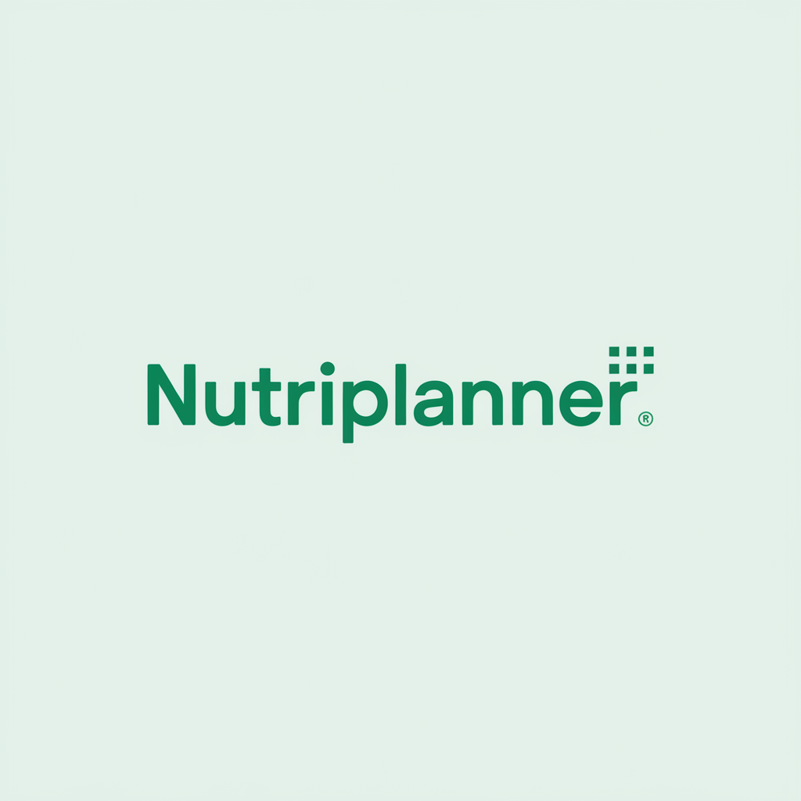

# 🥗 NutriPlanner

<div align="center">



Uma aplicação web moderna para planejamento nutricional personalizado baseado em ciência e I.A.

[](https://nextjs.org/)
[](https://www.typescriptlang.org/)
[](https://tailwindcss.com/)
[](LICENSE)

</div>

## 📋 Sobre o Projeto

NutriPlanner é uma aplicação web moderna desenvolvida para ajudar pessoas a obterem planos alimentares personalizados. Utilizando tecnologias de ponta e uma interface intuitiva, o sistema oferece recomendações nutricionais baseadas em dados científicos e algoritmos inteligentes.

### ✨ Características Principais

- 🎯 Planos nutricionais personalizados
- 📊 Interface moderna e responsiva
- 🔒 Perfil de usuário personalizado
- 📱 Design adaptativo para todos os dispositivos
- 🚀 Performance otimizada
- 🎨 UI/UX moderna com animações fluidas

## 🛠️ Tecnologias Utilizadas

- **Framework**: Next.js 13.5.1
- **Linguagem**: TypeScript
- **Estilização**: TailwindCSS
- **Componentes**: Radix UI
- **Animações**: Framer Motion
- **Formulários**: React Hook Form
- **Validação**: Zod
- **Estilo de Código**: ESLint

## 🚀 Como Começar

### Pré-requisitos

- Node.js (versão 16 ou superior)
- npm ou yarn

### Instalação

1. Clone o repositório
```bash
git clone https://github.com/thejoaomoura/nutri-planner.git
cd nutri-planner
```

2. Instale as dependências
```bash
npm install
# ou
yarn install
```

3. Crie um arquivo `.env.local` na raiz do projeto e adicione sua chave da API OpenAI:
```bash
OPENAI_API_KEY=sua_chave_api_aqui
```
> Você pode obter sua chave API em: https://platform.openai.com/api-keys

4. Inicie o servidor de desenvolvimento
```bash
npm run dev
# ou
yarn dev
```

5. Acesse `http://localhost:3000` no seu navegador

## 📚 Scripts Disponíveis

- `npm run dev` - Inicia o ambiente de desenvolvimento
- `npm run build` - Cria a build de produção
- `npm run start` - Inicia o servidor de produção
- `npm run lint` - Executa a verificação de linting
- `npm run typecheck` - Verifica tipos TypeScript
- `npm run analyze` - Analisa o bundle da aplicação

## 📁 Estrutura do Projeto

```
nutri-planner/
├── app/                    # Diretório principal da aplicação
│   ├── api/               # Endpoints da API
│   ├── formulario/        # Páginas de formulário
│   ├── profile/           # Páginas de perfil
│   ├── resultados/        # Páginas de resultados
│   └── layout.tsx         # Layout principal
├── components/            # Componentes reutilizáveis
├── public/               # Arquivos estáticos
└── styles/              # Estilos globais
```

## 🤝 Contribuindo

Contribuições são sempre bem-vindas! Por favor, leia o [guia de contribuição](CONTRIBUTING.md) primeiro.

1. Faça um Fork do projeto
2. Crie sua Feature Branch (`git checkout -b feature/AmazingFeature`)
3. Commit suas mudanças (`git commit -m 'Add some AmazingFeature'`)
4. Push para a Branch (`git push origin feature/AmazingFeature`)
5. Abra um Pull Request

## 📄 Licença

Este projeto está sob a licença MIT. Veja o arquivo [LICENSE](LICENSE) para mais detalhes.

## 📧 Contato

Para questões e sugestões, por favor abra uma [issue](https://github.com/thejoaomoura/nutri-planner/issues).

---

<div align="center">
Desenvolvido com ❤️ para uma vida mais saudável
</div>
